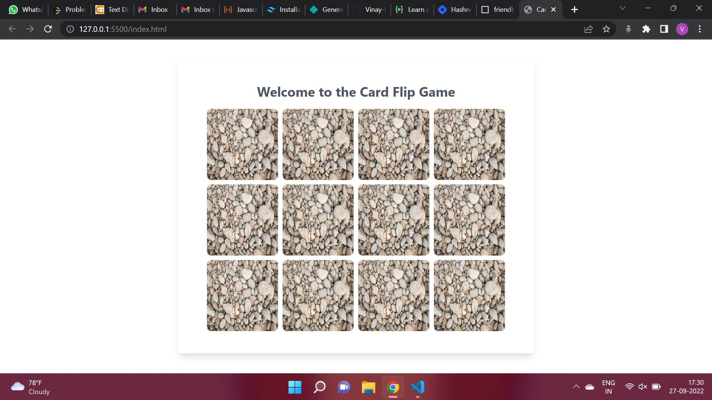

# **Memory Card Game or Card Flip Guess Game**
## **Overview**
This is a memory card game in which there is 12 images in which the user have to guess the correct pair in order to solve the game. Once the every pair of card is found the cards will automatically shuffle.

## **Technology Used**
1. HTML
2. Tailwind CSS
3. JavaScript

## **Output**

## **Live Link**
